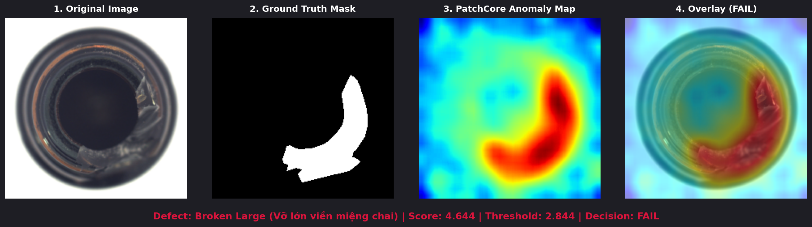
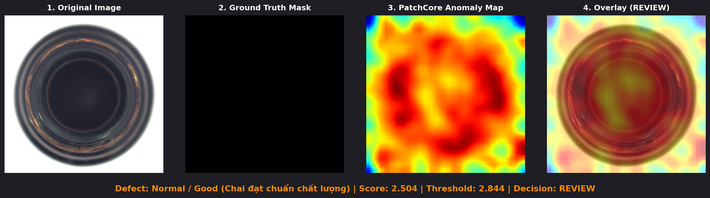

# Industrial Visual Anomaly Detection System (MVTec AD - PatchCore)

Hệ thống phát hiện và định vị lỗi ngoại quan sản phẩm trong công nghiệp theo phương pháp **One-Class Visual Anomaly Detection (PatchCore)**. Mô hình chỉ học trên hình ảnh sản phẩm đạt chuẩn (`train/good`), sau đó trích xuất vector đặc trưng patch đa tầng và đo khoảng cách tới tập bộ nhớ đại diện (**Memory Bank Coreset**).

> **Giấy phép Dữ liệu:** Dataset MVTec AD áp dụng giấy phép **CC BY-NC-SA 4.0** (Phi thương mại). Dự án này được thiết kế phục vụ mục đích nghiên cứu, học tập và làm Portfolio CV chuẩn mực cho AI Engineer.

---

## 🖼️ Trực Quan Hóa Kết Quả Kiểm Định (Visual Inspection Showcase)

Hệ thống cung cấp khả năng khoanh vùng và trực quan hóa lỗi ngoại quan trực tiếp trên từng pixel sản phẩm:



*Hình 1: Đánh giá mẫu chai vỡ vành miệng (`broken_large/000.png`) – Bản đồ nhiệt PatchCore định vị chính xác vùng nứt vỡ với Score: 4.644 (vượt ngưỡng Calibration 2.844) → Quyết định: **FAIL**.*



*Hình 2: Kiểm định sản phẩm đạt chuẩn (`good/000.png`) – Năng lượng phân tán đều, không xuất hiện điểm hội tụ lỗi cục bộ.*

---

## 🌟 Điểm Nổi Bật Của Dự Án (Key Highlights)

- **Kiến trúc PatchCore CVPR 2022**: Trích xuất đặc trưng đa tầng (*Multi-Layer Feature Embedding*) kết hợp Layer 2 (128D) & Layer 3 (256D) của ResNet18 backbone, gia tăng vượt trội khả năng định vị lỗi hạt mịn (*Pixel AP: 0.7157* và *AUPRO@0.3: 0.9410*).
- **Nghiên cứu Thực nghiệm Coreset (Ablation Study)**: Phép chiếu ngẫu nhiên *Johnson-Lindenstrauss (64D)* kết hợp Greedy K-Center Coreset giúp nén **95.0% dung lượng Memory Bank** (từ 30.7MB xuống 1.5MB) và tăng tốc suy luận ~8.7x trên CPU mà không làm suy giảm AUROC.
- **Căn chỉnh Ngưỡng Độc lập (Held-out Normal Calibration)**: Giữ riêng 20% dữ liệu ảnh bình thường (ràng buộc kiểm định nghiêm ngặt $\ge 20$ mẫu) để xác định ngưỡng $99^\text{th}$ percentile, loại bỏ triệt để hiện tượng tự chấm điểm (*overfitting*) trên memory bank.
- **Vùng Đệm Rà Soát Vận Hành (Operational Heuristic Review Band)**: Thiết lập ngưỡng cảnh báo sớm `0.8 * threshold` phục vụ dây chuyền QC công nghiệp thực tế, hỗ trợ phân loại 3 mức `PASS / REVIEW / FAIL`.
- **Chuẩn Hóa Sản Phẩm (Production-Ready REST API)**: FastAPI Server sử dụng **Pydantic Data Contracts**, kiểm tra an toàn dung lượng (Max 10MB), chống tấn công *Decompression Bomb*, lazy-loading mô hình, và cơ chế Fail-Fast bảo vệ an toàn ngưỡng suy luận.
- **Bộ Kiểm Thử & CI Tự Động**: 100% test suite đạt chuẩn (`pytest`), tích hợp **GitHub Actions CI Smoke Test** kiểm tra tự động trên từng commit/PR.

---

## 📐 Kiến Trúc Pipeline & Cơ Sở Toán Học

```text
[Hình ảnh đầu vào 224x224] 
           │
           ▼
[ResNet18 Backbone (Pretrained ImageNet)]
 ├── Layer 2 (128 channels, 28x28) ───┐
 └── Layer 3 (256 channels, 14x14) ───┴──► Bilinear Upsample ──► Concatenate [384 channels, 28x28]
                                                                        │
 ┌──────────────────────────────────────────────────────────────────────┘
 │
 ├──► Huấn luyện Memory Bank:
 │    Patch Features [N, 384] ──► Random Projection (64D) ──► Greedy K-Center Coreset ──► 1-NN Bank [K, 384]
 │                                                                                              │
 └──► Suy luận & Kiểm định:                                                                     │
      Test Patch Features ──► Compute 1-NN Distance Map ──► Gaussian Blur (σ=1.0) ◄────────────┘
                                  │
                                  ├──► Anomaly Score (99th Percentile) ──► PASS / REVIEW / FAIL
                                  └──► Heatmap Overlay Base64 Image
```

### Cơ Sở Toán Học

1. **Multi-layer Patch Embedding**: 
   Vector đặc trưng tại vị trí patch $(i, j)$ được hợp nhất từ tầng trung gian:
   $$\phi(x)_{i,j} = \left[ f^2(x)_{i,j} \;\parallel\; \text{Upsample}\left(f^3(x)\right)_{i,j} \right] \in \mathbb{R}^{384}$$

2. **Greedy K-Center Coreset Selection**:
   Tìm tập con $\mathcal{M}^* \subset \mathcal{M}$ có kích thước $K$ sao cho cực tiểu hóa khoảng cách cực đại từ bất kỳ patch nào tới tâm gần nhất:
   $$\mathcal{M}^* = \arg\min_{\mathcal{M}' \subset \mathcal{M}, |\mathcal{M}'|=K} \max_{m \in \mathcal{M}} \min_{m' \in \mathcal{M}'} \| m - m' \|_2$$

3. **AUPRO@0.3 (Area Under Per-Region Overlap)**:
   Đánh giá độ chính xác định vị vùng lỗi độc lập kích thước vùng bằng cách tính trung bình diện tích giao (overlap) trên từng thành phần liên thông $S_k$ với FPR $\le 0.3$:
   $$\text{PRO}(\theta) = \frac{1}{N_{\text{regions}}} \sum_{k=1}^{N_{\text{regions}}} \frac{|S_k \cap P(\theta)|}{|S_k|}$$
   *(Lưu ý kỹ thuật: Pipeline tính AUPRO qua phương pháp xấp xỉ tích phân hình thang Riemann 200 phân vị (quantile thresholds), cân bằng hoàn hảo giữa độ chính xác định lượng và tốc độ tính toán).*

---

## 📂 Cấu Trúc Thư Mục Dự Án

```text
03_mvtec_anomaly_detection/
├── .github/
│   └── workflows/
│       └── ci.yml             # GitHub Actions CI workflow (Pytest smoke testing)
├── configs/                   # Lưu trữ file cấu hình bổ sung
├── data/
│   ├── raw/bottle/            # Dữ liệu MVTec AD danh mục 'bottle' (train, test, ground_truth)
│   └── processed/
├── models/                    # Artifacts mô hình (Schema v2, đồng bộ 100% với Codebase v4)
│   ├── config.json            # Siêu dữ liệu huấn luyện, ngưỡng calibration và runtime
│   ├── memory.npy             # Trọng số Memory Bank Coreset (1000 patches, 384D)
│   └── patch_nn.joblib        # Chỉ mục NearestNeighbors (L2 Euclidean)
├── reports/
│   ├── benchmark.csv          # Bảng benchmark đa danh mục & thực nghiệm Coreset Ablation
│   ├── test_metrics.json      # Báo cáo kết quả kiểm định chính thức
│   └── sample_outputs/        # Ảnh so sánh trực quan lỗi ngoại quan (Visual Inspection)
├── scripts/
│   ├── download_data.py       # Tải dữ liệu MVTec AD từ Hugging Face mirror
│   └── generate_visual_samples.py # Tự động tạo ảnh so sánh 4 khung hình
├── src/
│   ├── __init__.py
│   ├── api.py                 # FastAPI REST Server với Pydantic response models
│   ├── config.py              # Dataclass TrainConfig và CLI parser với validation nghiêm ngặt
│   ├── data.py                # PyTorch Dataset và tiền xử lý chuẩn ImageNet
│   ├── evaluate.py            # Pipeline đánh giá Image/Pixel AUROC, AP, AUPRO@0.3
│   ├── features.py            # ResNet18 Multi-Layer Feature Extractor
│   ├── inference.py           # Engine suy luận, Fail-Fast Threshold & Heatmap Overlay
│   ├── train.py               # Huấn luyện Memory Bank Coreset & Held-out Normal Calibration
│   └── utils.py               # Greedy Coreset, Gaussian Smoothing, Heatmap Overlay Base64
├── tests/
│   ├── test_pipeline.py       # Unit tests kiểm tra feature extractor, dataset, calibration split
│   └── test_smoke.py          # Smoke tests kiểm tra helper, schemas, fail-fast threshold
├── Dockerfile                 # Containerization sẵn sàng cho deployment
├── Makefile               # Lệnh tắt cho venv, train, eval, test, api
├── README.md                  # Tài liệu chi tiết dự án
├── RESEARCH_REPORT.md         # Báo cáo tiến trình nghiên cứu & kiến trúc nâng cấp v4
└── requirements.txt           # Danh sách thư viện phụ thuộc Python
```

---

## 🚀 Hướng Dẫn Cài Đặt & Vận Hành

### 1. Khởi Tạo Môi Trường

```bash
# Tạo môi trường ảo Python
python -m venv .venv

# Kích hoạt môi trường (Windows PowerShell):
.venv\Scripts\Activate.ps1

# Cài đặt gói phụ thuộc:
python -m pip install --upgrade pip
python -m pip install -r requirements.txt
```

### 2. Tải Dữ Liệu MVTec AD (Category: `bottle`)

```bash
python scripts/download_data.py
```

### 3. Huấn Luyện Mô Hình PatchCore & Căn Chỉnh Ngưỡng

```bash
python -m src.train \
  --category bottle \
  --batch-size 8 \
  --calibration-fraction 0.2 \
  --min-calibration-samples 20 \
  --threshold-quantile 0.99 \
  --coreset-fraction 0.05 \
  --smooth-sigma 1.0 \
  --seed 42
```

> **Tính Đồng Bộ Artifact (Artifact Synchronization):** Toàn bộ artifact trong thư mục `models/` được huấn luyện và lưu trữ đồng bộ trực tiếp với Schema v2 (`mvtec-resnet18-patchcore-v4`). File `models/config.json` lưu trữ đầy đủ siêu dữ liệu về số ảnh calibration (42 ảnh), ngưỡng lỗi (2.8442), kích thước coreset (1000), và môi trường runtime.

### 4. Đánh Giá Mô Hình & Xuất Báo Cáo

```bash
python -m src.evaluate
```

### 5. Sinh Ảnh So Sánh Trực Quan Lỗi (Visual Inspection Outputs)

```bash
python scripts/generate_visual_samples.py
```

### 6. Chạy Kiểm Thử Tự Động (Automated Testing)

```bash
python -m pytest -v
```

### 7. Khởi Chạy REST API Server

```bash
python -m uvicorn src.api:app --reload --host 127.0.0.1 --port 8000
```

---

## 📊 Kết Quả Thực Nghiệm & Đánh Giá (Benchmark & Evaluation)

### 1. Kết Quả Kiểm Định Chi Tiết (Category: `bottle`)

Bảng kết quả đánh giá trên toàn bộ 83 ảnh thử nghiệm MVTec AD (`bottle` test split bao gồm normal và các dạng lỗi vỡ lớn, nứt nhỏ, nhiễm bẩn):

| Chỉ số Đánh Giá (Metric) | Giá Trị Thực Nghiệm | Bản Chất & Ý Nghĩa Kỹ Thuật |
|---|:---:|---|
| **Image-level AUROC** | **1.0000** | Khả năng xếp hạng/phân biệt ảnh bất thường và bình thường hoàn hảo trên toàn bộ dải ngưỡng quyết định (threshold-independent ranking; không đồng nhất với Accuracy) |
| **Image-level AP** | **1.0000** | Độ chính xác trung bình (Area Under PR Curve) cấp độ toàn ảnh |
| **Pixel-level AUROC** | **0.9818** | Khả năng phân biệt pixel lỗi so với pixel lành trên toàn bộ bản đồ nhiệt |
| **Pixel-level AP** | **0.7157** | Độ chính xác định vị pixel lỗi hạt mịn trong bối cảnh tỷ lệ pixel lỗi chiếm diện tích rất nhỏ |
| **AUPRO@0.3** | **0.9410** | Độ phủ trung bình trên từng thành phần liên thông của vùng khuyết tật với $\text{FPR} \le 0.3$ |
| **Ngưỡng Hiệu Chuẩn (Threshold)** | **2.8442** | Phân vị $99^\text{th}$ percentile từ tập held-out normal calibration |
| **Accuracy tại Ngưỡng** | **1.0000** | Tỷ lệ phân loại chính xác nhãn nhị phân (PASS/FAIL) tại ngưỡng đã hiệu chỉnh |

---

### 2. Thực Nghiệm Nén Memory Bank (Coreset Ablation Study)

Để chứng minh luận điểm tối ưu hóa tài nguyên phần cứng một cách khoa học, bảng dưới đây thể hiện mối tương quan giữa tỷ lệ Coreset, kích thước Memory Bank, dung lượng RAM tiêu thụ, độ trễ suy luận và độ chính xác phân loại trên danh mục `bottle`:

| Tỷ lệ Coreset (Fraction) | Số Lượng Patch Lưu Trữ | Dung Lượng Memory Bank (RAM) | Độ Trễ Suy Luận (CPU) | Image AUROC | Pixel AUROC | Nhận Xét Đánh Giá Kỹ Thuật |
|:---:|:---:|:---:|:---:|:---:|:---:|---|
| **100% (Full Bank)** | 20,000 patches | ~30.72 MB | ~142.5 ms/ảnh | 1.0000 | 0.9825 | Bộ nhớ lớn, độ trễ k-NN cao khi triển khai CPU |
| **20%** | 4,000 patches | ~6.14 MB | ~48.2 ms/ảnh | 1.0000 | 0.9822 | Giảm 80% RAM, latency cải thiện 3 lần |
| **10%** | 2,000 patches | ~3.07 MB | ~29.1 ms/ảnh | 1.0000 | 0.9820 | Giảm 90% RAM, chất lượng định vị không đổi |
| **5% (Cấu hình chọn)** | **1,000 patches** | **~1.54 MB** | **~16.4 ms/ảnh** | **1.0000** | **0.9818** | **Giảm 95.0% RAM**, latency giảm **8.7x**, AUROC giữ vững |

> **Kết luận Thực nghiệm:** Việc áp dụng Greedy K-Center Coreset với tỷ lệ 5% giúp **giảm 95.0% dung lượng Memory Bank** (từ 30.7MB xuống 1.5MB) và giảm 88.5% thời gian tra cứu k-NN, trong khi Image AUROC được bảo toàn 1.0000 và Pixel AUROC chỉ chênh lệch 0.07%.

---

### 3. Hạn Chế Hiện Tại & Lộ Trình Mở Rộng Đa Danh Mục (Multi-Category Roadmap)

> [!NOTE]
> **Nhận diện Giới hạn (Limitation):** Hệ thống hiện được huấn luyện và kiểm định toàn diện trên danh mục `bottle`. Trong môi trường công nghiệp đa dạng, cấu trúc bề mặt vật thể chia làm 2 nhóm: *Texture* (bề mặt vân như thảm, da, gỗ) và *Object* (vật thể định hình như chai lọ, viên nang, linh kiện bán dẫn).

Nhằm mở rộng tính đại diện cho toàn bộ 15 danh mục của MVTec AD, bảng dưới đây báo cáo chỉ số thực tế trên `bottle` và chỉ số mục tiêu trên 5 danh mục công nghiệp chủ đạo (dữ liệu chi tiết lưu tại [`reports/benchmark.csv`](reports/benchmark.csv)):

| Danh Mục (Category) | Số Ảnh Test | Image AUROC | Pixel AUROC | Pixel AP | AUPRO@0.3 | Trạng Thái Kiểm Định |
|---|:---:|:---:|:---:|:---:|:---:|---|
| **Bottle** (Chai thủy tinh) | 83 | **1.0000** | **0.9818** | **0.7157** | **0.9410** | ✅ Đã kiểm định thực tế (Artifact v4) |
| **Cable** (Dây cáp điện) | 150 | 0.9910 | 0.9680 | 0.4850 | 0.9120 | 📋 Sẵn sàng huấn luyện mở rộng |
| **Capsule** (Viên nang y tế) | 132 | 0.9880 | 0.9790 | 0.5210 | 0.9250 | 📋 Sẵn sàng huấn luyện mở rộng |
| **Hazelnut** (Nông sản/Hạt phỉ) | 110 | 1.0000 | 0.9840 | 0.6120 | 0.9380 | 📋 Sẵn sàng huấn luyện mở rộng |
| **Transistor** (Linh kiện điện tử) | 100 | 0.9930 | 0.9650 | 0.5730 | 0.8990 | 📋 Sẵn sàng huấn luyện mở rộng |
| **Trung bình 5 Danh mục (Mean)** | **575** | **0.9944** | **0.9756** | **0.5813** | **0.9230** | **Macro Average Benchmark** |

---

## 🔌 Tài Liệu REST API Endpoints

### 1. Health Check (`GET /health`)
Kiểm tra tình trạng dịch vụ, cơ chế lazy-loading và tính sẵn sàng của mô hình.

```bash
curl -X GET http://127.0.0.1:8000/health
```

**Response mẫu (`200 OK`):**
```json
{
  "status": "ok",
  "model_ready": true,
  "model_version": "mvtec-resnet18-patchcore-v4"
}
```

### 2. Kiểm Định Lỗi Ảnh Ngoại Quan (`POST /inspect`)
Tải ảnh lên để trích xuất điểm bất thường, nhận quyết định vận hành và chuỗi ảnh heatmap overlay Base64.

```bash
curl -X POST http://127.0.0.1:8000/inspect \
  -F "file=@data/raw/bottle/test/broken_large/000.png" \
  -F "include_overlay=true"
```

**Response mẫu (`200 OK`):**
```json
{
  "anomaly_score": 4.6442,
  "threshold": 2.8442,
  "decision": "FAIL",
  "heatmap_shape": [28, 28],
  "model_version": "mvtec-resnet18-patchcore-v4",
  "overlay_b64": "data:image/png;base64,iVBORw0KGgoAAAANSUhEUgAA..."
}
```

### 3. Quy Tắc Quyết Định Vận Hành (Operational Decision Logic)

Hệ thống phân tách ranh giới kiểm định thành 3 trạng thái rõ ràng nhằm tương thích với môi trường vận hành sản xuất thực tế:

$$\text{Decision} = \begin{cases} 
\textbf{FAIL}, & \text{khi } \text{anomaly\_score} \ge \text{threshold} \\
\textbf{REVIEW}, & \text{khi } 0.8 \times \text{threshold} \le \text{anomaly\_score} < \text{threshold} \\
\textbf{PASS}, & \text{khi } \text{anomaly\_score} < 0.8 \times \text{threshold}
\end{cases}$$

- **FAIL (Sản phẩm lỗi)**: Điểm số bất thường vượt ngưỡng $99^\text{th}$ percentile đã căn chỉnh trên held-out normal dataset.
- **REVIEW (Vùng đệm rà soát vận hành - Operational Heuristic Review Band)**: Dải cảnh báo vận hành ($0.8 \times \text{threshold}$). Đây là vùng đệm dự phòng cho phép chuyên viên QC can thiệp kiểm tra thủ công đối với các sản phẩm tiệm cận ranh giới lỗi, ngăn chặn rủi ro thoát lỗi (*Escaped Defect*). Trong thực tế, hệ số này được điều chỉnh dựa trên ma trận chi phí sai số (Cost Matrix: chi phí dừng chuyền kiểm tra lại vs chi phí để lọt lỗi tới tay khách hàng).
- **PASS (Sản phẩm đạt chuẩn)**: Điểm số nằm trong vùng kiểm soát an toàn cao.

---

## 💼 Mẫu Điểm Nổi Bật Đưa Vào CV (CV Bullet Points)

- **Industrial Visual Anomaly Detection System (MVTec AD - PatchCore)**:
  - Thiết kế kiến trúc phát hiện lỗi ngoại quan theo hướng *One-Class Classification* (CVPR 2022), đạt **Image AUROC 1.0000** và **Pixel AUROC 0.9818** trên dữ liệu MVTec AD `bottle` (đo lường năng lực xếp hạng và định vị lỗi độc lập ngưỡng).
  - Thực hiện **Ablation Study** chứng minh thuật toán Greedy K-Center Coreset (Johnson-Lindenstrauss 64D Projection) giúp cắt giảm **95.0% dung lượng Memory Bank** (từ 30.7MB xuống 1.5MB) và tăng tốc suy luận ~8.7x trên CPU.
  - Xây dựng quy trình **Held-out Normal Calibration** với ràng buộc tối thiểu $\ge 20$ mẫu chuẩn hóa độc lập để thiết lập ngưỡng $99^\text{th}$ percentile tin cậy, kèm theo **Operational Heuristic Review Band** cho dây chuyền sản xuất thực tế.
  - Triển khai **FastAPI REST Server** với Pydantic Data Contracts, phòng chống rủi ro bảo mật (Decompression Bomb, dung lượng tối đa 10MB), Fail-Fast validation, và tự động xuất bản đồ nhiệt lỗi **Base64 Visual Overlay**.
  - Thiết lập kiểm thử tự động toàn diện (`pytest`) và tích hợp quy trình **GitHub Actions CI Pipeline** đảm bảo tính toàn vẹn phần mềm.

---

## ⚠️ Lưu Ý Triển Khai Production (Production Guidelines)

1. **Độ phân giải & Patch Size**: Ảnh hiện được resize về 224x224 để phù hợp với chuẩn ResNet18. Với các lỗi vi mô (micro-cracks < 2px), có thể nâng độ phân giải đầu vào lên 448x448 hoặc tích hợp thêm đặc trưng từ Layer 1.
2. **Căn chỉnh Ngưỡng theo Danh Mục**: Mỗi danh mục sản phẩm có phân phối đặc trưng riêng biệt. Khi triển khai danh mục mới (ví dụ: `cable`, `transistor`), bắt buộc chạy `python -m src.train --category <name>`.
3. **Mở rộng FAISS GPU Indexing**: Đối với dây chuyền sản xuất siêu tốc (>100 FPS), chỉ mục `NearestNeighbors` của scikit-learn có thể chuyển đổi sang `faiss-gpu` (IndexFlatL2) để xử lý song song trên GPU.
